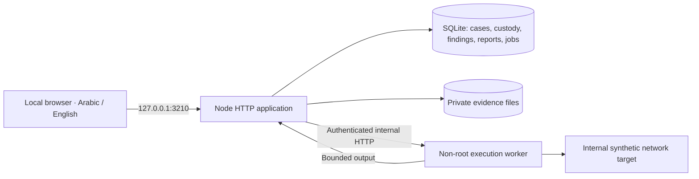

# Linux architecture / البنية المحلية

## Data and execution flow

The frontend is a production Vite/React static build. The local Node server authenticates the examiner, serves the interface and adapts the common API to durable SQLite/files. The local adapter tracks incremental migration names and checksums and rejects changed applied migrations. Evidence uses application-generated object keys; users cannot select filesystem paths.

Jobs are stored in SQLite. A single queue dispatcher checks case ownership, open status and input hashes before transferring bounded evidence bytes to the worker. The worker selects a predefined executable and arguments, writes a temporary input copy, executes without a shell, captures bounded output and removes the temporary directory. The app deposits output through the shared evidence and custody API. A concurrent case closure rejects the deposit rather than silently writing into a closed case. Failed jobs retain an error and require explicit resubmission. On application restart, previously queued/running jobs are marked failed; they are not replayed silently.

The Docker worker has no evidence/database volume and no Docker socket. The control and simulation networks are internal; only the app's localhost web port is published. Tool availability is checked from the worker filesystem. Configure additional approved targets as named entries in `LAB_TARGETS`; the default is the internal synthetic target. Network changes require a separate scope and isolation review.

## Model and constraints

- Core tables: cases, evidence, tasks, custody, events, imports, findings, reports.
- Local tables: migration history, hashed expiring sessions and execution jobs.
- One local account; named task assignees are descriptive fields, not independently authenticated users.
- Report content snapshots have hashes; review is attributed to the current local account.
- Audit checksums can detect modified retained rows, but cannot prove that a database administrator did not delete history.
- Images, package versions and analysis rules must be recorded and qualified by the operating organization before evidence-bearing use.

## Release evidence

The common API and local two-profile end-to-end flow have automated tests. The included Linux CI additionally builds both Docker targets and runs real executable fixtures for all registered profiles. That workflow must succeed before the release is described as verified on Linux. No government accreditation, independent penetration test or global ranking is claimed.

