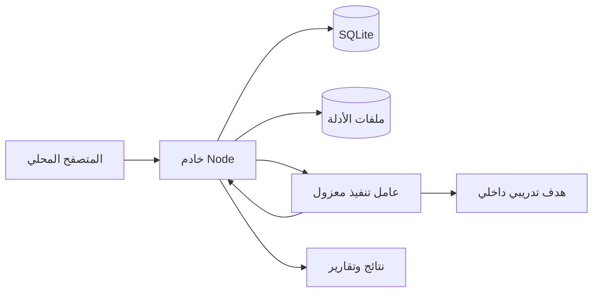

# مختبر طلال السيبراني

## التقرير الهندسي ودليل تسليم المشروع

تاريخ المراجعة: 2026-09-07. النسخة: Linux 0.3.0-alpha.1. المطور: م. طلال فواز السحيمي. الموقع الرسمي: https://talalsuhaimi.com. البريد: talal@talalsuhaimi.com.

### 1. نطاق المصدر وحالة التسليم

يعتمد هذا التقرير على الشيفرة المحلية المحفوظة في Git عند الالتزام c6e93b40049e900131d47a92728f96c2ccfca75d. يوجد فرع main والتزام واحد في هذا المستودع المحلي. نسخ التاريخ المتاح لا ينشئ تاريخاً سابقاً غير موجود. عند بدء التوثيق لم يكن المستودع بالاسم المقترح متاحاً عبر GitHub، لذلك لا توصف النسخة المرفقة بأنها مستنسخة من GitHub.

أنشئت نسخة مرآة ونسخة عمل وأرشيف Git bundle لجميع المراجع المتاحة. لم يتغير الكود الأصلي أثناء هذه المراجعة. الوثائق المقترحة والتوصيات منفصلة عن المصدر؛ التوصية بميزة لا تعني أنها منفذة.

المشروع منصة تحقيق رقمي محلية لإدارة قضايا محددة النطاق، حفظ ملفات الأدلة، تشغيل تحليلات محددة، مراجعة النتائج وإنتاج التقارير. لا يمثل جهاز تصوير جنائي كامل الأقراص، ولا منصة حكومية معتمدة، ولا يثبت أي ترتيب عالمي. يجب الفصل بين مكتبة مصادر الأدوات، وموصلات قراءة النتائج، وملفات التشغيل الفعلية.

### 2. ملخص تنفيذي للتغطية

| المكون | الموجود في المصدر | حدود التحقق |
|---|---|---|
| الواجهة | عربية وإنجليزية؛ اتجاه RTL/LTR؛ قضايا وأدلة ومهام وتدقيق | نجح بناء الواجهة؛ لم ينفذ فحص بصري شامل لها |
| التخزين | SQLite وسجل ترحيلات وملفات أدلة محلية | اختبارات محلية للدوام والمعاملات وعزل المالك |
| مكتبة الأدوات | 40 مدخلاً عبر 8 تخصصات | روابط ومعلومات؛ ليست 40 برنامجاً مثبتاً |
| الموصلات | 6 صيغ نتائج مع معاينة واستيراد | ملفات اصطناعية؛ ليس جميع إصدارات الموردين |
| التنفيذ | 15 ملف تشغيل مسجلاً | اختبرت وظيفتا البصمات والنصوص فعلياً؛ 13 وظيفة Linux خارجية لم تختبر هنا |
| التقارير | 6 أنواع بلغتين، نسخ محفوظة وبصمات ومراجعة | Markdown وHTML وJSON؛ النتائج CSV |
| القبول على Linux | Dockerfile وCompose وGitHub Actions واختبار قبول | لم ينفذ Docker هنا لغياب محرك يعمل |

### 3. الهيكلية ومسار الطلب



يبني Vite واجهة React كملفات ثابتة. يقدم خادم Node هذه الملفات بعد التحقق من جلسة المستخدم، ويوجه طلبات المختبر إلى طبقة API مشتركة. تحول طبقة التخزين واجهة الاستعلامات وملفات الأدلة إلى SQLite ونظام الملفات. يتلقى عامل مستقل نسخة مؤقتة من الدليل ويشغل برنامجا محدداً بمعاملات ثابتة، ثم يعيد المخرجات ليحفظها الخادم كدليل جديد.

تتكون بيئة Compose من app وworker وtraining-target. ينشر app المنفذ 3210 على عنوان المضيف المحلي فقط. العامل لا يملك وحدة قاعدة البيانات أو مقبس Docker. شبكتا control وsimulation داخليتان؛ الهدف التدريبي HTTP على المنفذ 8080. لا يتضمن الإعداد آلة Windows افتراضية أو نظام تشغيل T Phantom.

### 4. دليل المجلدات والملفات

| المسار | المسؤولية |
|---|---|
| index.html وlocal/main.tsx | نقطة الدخول؛ تركيب مكون Home واستيراد أنماط العرض |
| app/page.tsx | حالة اللغة والقضية النشطة والتنقل والنماذج والاتصال بـAPI |
| app/globals.css وlab.css وcyber.css | رموز التصميم وتخطيط الواجهة والهوية السيبرانية |
| components/lab/ToolLibrary.tsx | بحث وتصنيف مكتبة الأدوات وروابط المصادر والانتقال للتشغيل |
| components/lab/OperationsPanel.tsx | معاينة الاستيراد ومراجعة النتائج وتحرير التقارير وحفظها |
| components/lab/ExecutionPanel.tsx | فحص العامل واختيار ملف التشغيل والمدخل ومتابعة المهام |
| components/ui/ | عناصر واجهة قابلة لإعادة الاستخدام؛ زر وجدول وتبويبات وقوائم ونماذج وغيرها |
| hooks/use-mobile.ts | استجابة مكونات الواجهة لحجم العرض |
| lib/utils.ts | تجميع فئات CSS المستخدمة بالمكونات |
| lib/lab-core.mjs | القضايا والأدلة والمهام والحيازة والتدقيق وحراس الطلبات |
| lib/extended-api.mjs | الاستيراد والنتائج والتقارير المحفوظة ومراجعتها |
| lib/connectors.mjs | محللات صيغ الأدوات وضبط المدخلات وعدد السجلات |
| lib/connector-registry.mjs | وصف الموصلات القابل للاستخدام في الواجهة دون استيراد محلل XML |
| lib/reporting.mjs | توليد محتوى التقارير وحماية صادرات النص وCSV |
| lib/tool-catalog.json | مصدر بيانات مكتبة الأدوات وتصنيفاتها |
| local/server.mjs | HTTP والمصادقة والجلسات والملفات الثابتة وتوجيه API |
| local/storage.mjs | SQLite والترحيلات ومخزن الملفات المحلي واستعادة حالات الوظائف بعد الانقطاع |
| local/setup.mjs | إنشاء هوية محلية وكلمة مرور أولية وبصمتها |
| local/change-password.mjs | تغيير كلمة المرور من stdin وإبطال الجلسات؛ يلزم إعادة تشغيل app |
| local/jobs.mjs | قائمة التنفيذ واستدعاء العامل وإيداع الناتج واستيراده عند الدعم |
| local/worker.mjs | واجهة عامل HTTP تتحقق من سر الاتصال وتنفذ مهمة واحدة في الوقت نفسه |
| local/engine.mjs وprofiles.mjs | اكتشاف البرامج وتعريف العمليات الثابتة وحدود التنفيذ |
| local/fixtures.mjs وacceptance.mjs | إنشاء عينات اصطناعية وفحص تنفيذ البرامج فعلياً |
| db/schema.ts وdrizzle/ | تعريف الجداول والترحيلات التراكمية ومحفزات حماية القضايا المغلقة |
| tests/ | اختبارات النواة والموصلات والتخزين والتشغيل المحلي |
| public/ | الشعار والقوالب والأدلة والعينات القابلة للتنزيل |
| rules/default.yar | قاعدة علامة تدريبية؛ ليست مكتبة شاملة لكشف البرمجيات الخبيثة |
| Dockerfile وcompose.yaml وinstall.sh | بناء التطبيق والعامل وإعداد الخدمات المحلية |
| backup.sh | إيقاف كاتب قاعدة البيانات ونسخ وحدة البيانات ثم إعادة التطبيق |
| .github/workflows/linux.yml | تثبيت التبعيات والاختبارات والبناء وقبول Docker على Ubuntu |
| package.json وpackage-lock.json | أوامر المشروع وتبعياته المباشرة والمقفلة |
| tsconfig.json وvite.local.config.ts | إعداد TypeScript وبناء الواجهة المحلية |

يضم FILE-INVENTORY.md جرد الملفات المتتبعة مع تصنيفها وحجمها وبصمتها، دون ملفات البيانات والتبعيات المثبتة. وجود مكون واجهة في المكتبة لا يعني ظهوره في الصفحة الحالية؛ تحدد الاستيرادات ومسارات الاستخدام المكونات الفعلية.

### 5. نموذج البيانات

حقل owner يربط السجلات بالهوية المحلية. أسماء المكلفين بالمهام أو حائزي الأدلة حقول وصفية، ولا تنشئ حسابات مستخدمين مستقلة. يستخدم تشغيل Linux حساباً محلياً واحداً رغم وجود عزل المالك في API المشترك.

| الجدول | المحتوى والعلاقات |
|---|---|
| cases | العنوان والتفويض والنطاق والنوع والحالة والتاريخ |
| evidence | مرجع القضية والاسم والمصدر والحائز والحجم وSHA-256 ومفتاح الملف |
| custody | انتقال الحيازة من شخص إلى آخر مع السبب والوقت والدليل |
| tasks | المهمة والمكلف بها وحالتها والقضية |
| events | حمولة الحدث وبصمتها المستقلة؛ ليست سلسلة توقيع خارجية |
| imports | الموصل وإصدار المحلل وبصمة المصدر وعدد النتائج؛ قيد يمنع تكرار المصدر نفسه |
| findings | العنوان والأصل والشدة والوصف والتوصية والدليل والمراجعة ورقم التنقيح |
| reports | نوع التقرير ولغته ومحتواه وبصمته وحالة مراجعته وهوية المراجع |
| revision_guards | جدول تأكيد فارغ يدعم رفض تحديث متعارض داخل المعاملة |
| local_migrations | أسماء الترحيلات وبصماتها للتحقق من ثبات التاريخ المطبق |
| local_sessions | بصمات رموز الجلسات ووقت انتهائها |
| local_jobs | الأداة والمدخل والهدف والحالة والناتج أو الخطأ والتوقيت |

تستخدم المعاملات BEGIN IMMEDIATE وتجري تراجعاً عند فشل أي تعليمة. يفعّل المخزن المفاتيح الأجنبية وWAL ومهلة انشغال 5 ثوان. لا توجد علاقة خارجية معلنة بين local_jobs والجداول الأساسية؛ يطبق مسار الوظائف فحوص الملكية والوجود برمجياً.

### 6. شرح الوحدات والمنطق البرمجي

تستدعي Home الدالة call لإرسال الطلبات، وتستخدم refresh لإعادة بيانات القضايا والأدلة والمهام. لا يكفي تحديث حالة الواجهة لإثبات حفظ العملية؛ يجب نجاح استجابة الخادم. تعيد لوحة التنفيذ قراءة الحالة كل أربع ثوان تقريباً وتعرض عدم توفر العامل أو الأداة بدلاً من افتراض التثبيت.

تبدأ createApp بتهيئة الحساب والمخزن وقراءة إعداد الأصل والعامل. يتحقق الخادم من Host، ويخزن الجلسات كبصمات، ويعيد المستخدم غير المصادق إلى /login أو يعيد 401 للـAPI. يستخدم تسجيل الدخول scrypt وملحاً عشوائياً ومقارنة ثابتة الزمن. تنتهي الجلسة بعد 12 ساعة. تطبق قيود محاولات تسجيل الدخول على التطبيق ككل، وليست على هوية كل عميل.

تفحص handleLab الهوية والتخزين وطريقة الطلب. تتطلب التعديلات Origin مطابقاً وx-lab-action بقيمة 1. تمنع caseFor الوصول إلى قضية غير مملوكة أو تعديل قضية مغلقة. تحسب sha256 بصمة البيانات، وتضبط readBounded أقصى حجم مقروء. تضبط field طول الحقول والمحارف المرفوضة. تستخدم الاستعلامات معاملات ربط بدلاً من تركيب نص SQL من مدخلات المستخدم.

عند الإيداع يحفظ المخزن الملف ثم تضيف معاملة قاعدة البيانات بيانات الدليل والاستلام الأولي وحدث التدقيق. إذا فشلت المعاملة يحاول المسار حذف الملف المرحلي. يعيد التحقق حساب البصمة من الملف المخزن. انتقال الحيازة يقارن الحائز المتوقع بالحالي، ويكتب الانتقال والتحديث والتدقيق بصورة تمنع اعتماد نقلين متعارضين.

تقرأ extendedApi ملف النتائج المودع، وتتحقق من بصمته وانتمائه إلى القضية قبل parseConnector. المعاينة لا تحفظ نتائج. الاستيراد يضيف سجل العملية والنتائج وحدث التدقيق في معاملة واحدة. كل نتيجة تبدأ pending؛ التأكيد أو الاستبعاد يحتاج ملاحظة ورقم revision مطابقاً، وإلا يعاد تعارض 409.

تنشئ renderReport محتوى من سجلات القضية الموجودة دون اختلاق استنتاجات. يختلف ترتيب الأقسام حسب نوع التقرير. ينشئ حفظ التقرير معرفاً وبصمة ونسخة محتوى جديدة؛ لا يعدل نسخة سابقة. تمنع المراجعة إذا اختلفت البصمة، وتنسب إلى الحساب الحالي. يصدر HTML نص Markdown مهرباً داخل pre؛ هو صالح للطباعة ولكنه ليس تحويل Markdown إلى تنسيق غني.

تتحقق jobs.route من القضية ونوع التحليل ومدخل الدليل وتوفر البرنامج والهدف المعتمد، ثم تحفظ وظيفة queued. تمنع drain تشغيل أكثر من حلقة توزيع داخل العملية نفسها. تتحول المهمة إلى running، ويتحقق مجدداً من القضية وبصمة الدليل، ثم يرسل البايتات إلى العامل. تحفظ النتيجة كدليل؛ إذا كان الملف Nmap يستدعى موصل XML آلياً. نجاح التنفيذ لا يضمن نجاح الاستيراد؛ يمكن أن تكون المهمة succeeded مع رسالة توضح أن الملف حفظ ولم يكتمل الاستيراد.

تستخدم execute أوامر ثابتة مع shell:false. تنفذ البصمات والنصوص داخل Node، وتكتب المدخلات الأخرى في ملف مؤقت ثم تشغل البرنامج المطلوب. تضبط command الوقت والمخرجات وتقتل العملية عند تجاوز الحد. تحذف الملفات المؤقتة في finally. لا توجد واجهة لتشغيل أمر shell عام أو تمرير أعلام عشوائية.

عند إعادة تشغيل التطبيق تتحول الوظائف queued وrunning المتبقية إلى failed مع server_restarted؛ لا يعاد تشغيلها تلقائياً. هذا سلوك استرداد محافظ يحتاج إجراء إعادة إرسال من المستخدم. قائمة الوظائف المعروضة محدودة بآخر 100 وظيفة للقضية، ولا توجد صفحات استعراض أقدم في الواجهة الحالية.

### 7. واجهات API الرئيسية

المسارات التالية نسبية إلى /api/lab. تستخدم الجلسة المحلية ولا تتطلب وضع رموز دخول في الوثائق. ترسل التعديلات المعتادة JSON مع Origin وx-lab-action. إيداع الدليل يرسل بايتات الملف وبياناته في x-evidence-meta.

| الطريقة والمسار | الوظيفة |
|---|---|
| GET / | بيانات المالك وإحصاءات النتائج |
| POST /cases | إنشاء قضية مع title وscope وtype |
| POST /cases/:id/status | إغلاق أو إعادة فتح القضية؛ تمنع المهام المفتوحة الإغلاق |
| POST /cases/:id/evidence | إيداع ملف وحساب بصمته |
| GET /evidence/:id/download | تنزيل الملف؛ يسجل الوصول في التدقيق |
| POST /evidence/:id/verify | إعادة حساب البصمة ومقارنتها |
| GET وPOST /evidence/:id/custody | قراءة أو تسجيل انتقال الحيازة |
| POST /cases/:id/tasks و/tasks/:id | إنشاء المهمة أو تغيير حالتها |
| GET /audit | الأحداث والتحقق من بصماتها الحالية |
| GET /connectors | قائمة الموصلات |
| POST /cases/:id/imports/preview | تحليل النتائج للمعاينة فقط |
| GET وPOST /cases/:id/imports | سجل الاستيراد أو تأكيده |
| GET وPOST /cases/:id/findings | قراءة النتائج أو إضافة نتيجة يدوية |
| POST /findings/:id | المراجعة بحالة وملاحظة ورقم تنقيح |
| GET /cases/:id/findings/csv | تصدير النتائج مع حماية بادئات صيغ الجداول |
| GET /cases/:id/reports/draft | توليد مسودة باستخدام kind وlang |
| GET وPOST /cases/:id/reports | قائمة النسخ المحفوظة أو حفظ نسخة |
| GET /reports/:id و/reports/:id/html | قراءة النسخة والتحقق من البصمة أو تنزيل HTML |
| POST /reports/:id/review | تسجيل مراجعة نسخة التقرير |
| GET /execution/status | حالة العامل وملفات التشغيل والأهداف المعتمدة |
| GET وPOST /execution/jobs?caseId=... | سجل التنفيذ أو إضافة مهمة |

يوجد أيضاً مسار قديم GET /cases/:id/report لتوليد تقرير غير محفوظ. يختلف عن استوديو النسخ المحفوظة؛ ينبغي تمييزهما عند تطوير تكاملات خارجية. مسارا العامل /status و/execute داخليان ويتطلبان x-worker-token، ولا ينشران للمستخدمين مباشرة.

### 8. تشغيل الأدوات والموصلات

ملفات التنفيذ المسجلة هي hashes وstrings وfile وexiftool وpdfinfo وpdftotext وmmls وfsstat وfls وimg-stat وcapinfos وtshark وssdeep وyara وnmap. افحص جاهزية كل ملف تشغيل من العامل؛ وجود اسمه في profiles.mjs لا يثبت تثبيت البرنامج أو سلامة عمله على كل صيغة مدخلات.

يشغل Nmap فحص TCP connect للمنافذ 22 و80 و443 و8080 على معرف هدف مضبوط مسبقاً. يستخدم tshark ملف PCAP محفوظاً ويحد عدد الحزم إلى 1000 مع إخراج JSON؛ لا ينفذ التقاطاً حياً. تعالج أدوات Sleuth Kit صوراً صغيرة مودعة، وقد يحتاج fsstat وfls صورة نظام ملفات مباشرة؛ واجهة المشروع لا تتيح تحديد إزاحة قسم داخل صورة كاملة.

تقبل الموصلات Nmap XML، وZAP JSON ذي مصفوفة site، وSARIF 2.1.0، وسجلات Zeek conn بصيغة JSONL، وصفوف Volatility JSON، وNuclei JSONL. لا يتصل الموصل تلقائياً بمنتج المورد. ترفض تعريفات XML الخارجية والكيانات المخصصة؛ تسمح صيغة Nmap بتعريف DOCTYPE العادي بلا مصادر خارجية.

### 9. التثبيت والتشغيل

المسار المقصود Linux مع Docker Engine وCompose v2 وOpenSSL. صورة Node المستخدمة node:24-bookworm-slim. واجهة React 19.2.8 وVite 8.2.2، وتعريف البيانات Drizzle، ومحلل XML fast-xml-parser. package-lock.json هو مرجع تبعيات npm المقفلة. صور الحاويات وحزم apt ليست مثبتة ببصمات غير قابلة للتغير في هذه النسخة.

```bash
bash install.sh
docker compose exec app cat /data/initial-password.txt
docker compose ps
```

يفحص المثبت Docker، وينشئ .env بصلاحيات مقيدة مع سر عشوائي إذا لم يوجد، ثم يبني الخدمات ويشغلها وينتظر فحص صحة app. كلمة المرور الأولية منفصلة عن سر العامل. لا تتضمن هذه الوثائق قيمة أي منهما. افتح http://localhost:3210 وسجل الدخول. قراءة كلمة المرور تتم على جهاز صاحب التثبيت فقط.

| الإعداد | الاستخدام |
|---|---|
| LAB_DATA | مجلد SQLite والأدلة والحساب؛ /data داخل الحاوية |
| LAB_ORIGIN | أصل الواجهة المسموح؛ الافتراضي localhost:3210 |
| LAB_BIND وPORT | عنوان استماع app ومنفذه |
| LAB_WORKER_URL | عنوان العامل الداخلي |
| LAB_WORKER_TOKEN | سر الاتصال؛ لا ينشر ولا يوضع في المستودع |
| LAB_TARGETS | كائن يربط معرفات الأهداف بعناوين معتمدة |
| WORKER_HOST وWORKER_PORT | استماع خدمة العامل |

يتطلب البناء الأول الإنترنت لتنزيل التبعيات. بعد البناء لا تعتمد العمليات المحلية المضمنة على حساب ChatGPT أو Sites. ليست توصية الذاكرة 4 GiB والمساحة 10 GiB ضمان أداء؛ يجب قياس احتياج المؤسسة على أحجام وأعداد قضايا ممثلة.

### 10. سيناريوهات استخدام

السيناريو الأول: أنشئ قضية تدريبية وحدد النطاق. أودع ملفاً نصياً معروف المحتوى وحدد الحائز. افتح تشغيل الأدوات واختر hashes ثم الملف. تابع اكتمال المهمة، وافتح الدليل الناتج للتحقق من SHA-256 وSHA-512. شغّل التحقق من البصمة في خزنة الأدلة قبل استخدام الناتج في التقرير.

السيناريو الثاني: أودع عينة Nmap XML ثم اختر موصل Nmap. عاين عدد السجلات وتأكد من الأصل، ثم أكد الاستيراد. راجع النتائج pending وسجل سبب التأكيد أو الاستبعاد. المنفذ المفتوح ملاحظة معلوماتية ولا يثبت ثغرة. يمنع استيراد المصدر نفسه بالموصل نفسه إلى القضية مرتين.

السيناريو الثالث: اختر ملف تشغيل nmap والهدف training. يحفظ الناتج كدليل ويحاول استيراده آلياً. عند وجود output_saved_import_not_completed راجع الملف وسجل الخطأ؛ لا تفترض فشل عملية الفحص أو نجاح تحويلها إلى نتائج دون مراجعة.

السيناريو الرابع: افتح التقارير واختر التحقيق أو الاختبار أو الحادث أو الملخص التنفيذي أو الحيازة أو المعالجة. اختر اللغة، ولد المسودة، استكمل التفسير والقيود ثم احفظ نسخة. راجع بصمتها وسجل ملاحظة المراجعة ونزل الصيغة المطلوبة. أكمل المهام قبل إغلاق القضية. تعديل المحرر دون حفظ نسخة لا يضمن الاحتفاظ به بعد مغادرة القسم.

### 11. الاختبارات وضبط الجودة

```bash
npm ci
npm test
npx tsc --noEmit
npm run build
docker compose exec app node local/acceptance.mjs
```

تضم الاختبارات 28 اختباراً اجتازت في بيئة التطوير السابقة لهذه المراجعة: نواة API، صيغ الاستيراد الاصطناعية، المعاملات، التزامن، عزل المالك، تغير البصمة، تخزين محلي، مصادقة، وتشغيل وظيفتي hashes وstrings عبر عامل HTTP فعلي. نجح TypeScript وبناء الواجهة وفحص تركيب Compose. لا تعد هذه نتائج اختبار Linux للحاويات أو تحققاً من وظائف البرامج الخارجية الثلاث عشرة.

يشغل سير عمل GitHub على Ubuntu الاختبارات والبناء ثم install.sh وفحص القبول. يولد الفحص نصاً وPDF وPCAP وصور FAT/MBR وعلامة YARA تدريبية، ويطلب تشغيل كل ملف ويختبر إيداع الناتج وبصمته والتقرير. لا توجد هنا نتيجة تشغيل ناجحة لهذا السير بعد. الفحص يترك قضية تدريبية مغلقة؛ خيار حذف وحدة البيانات في CI مخصص لبيئة الاختبار المؤقتة فقط.

### 12. الصيانة والتشخيص

راجع docker compose ps والسجلات المحدودة قبل إعادة المحاولة. worker_unavailable يعني فشل الوصول إلى العامل أو مصادقته، وtool_unavailable يعني عدم توفر البرنامج، وcase_closed يتطلب إعادة فتح القضية، وevidence_hash_mismatch يتطلب التحقيق في سلامة المخزن. execution_timeout وoutput_limit يعنيان تجاوز حدود العملية؛ لا ترفع الحدود تلقائياً دون تقييم موارد وعزل.

استخدم backup.sh لنسخ قاعدة البيانات وWAL والأدلة وبيانات الحساب معاً بعد إيقاف الكاتب. حافظ على سرية النسخة الاحتياطية لأنها تشمل بيانات الدخول. استعد إلى وحدة جديدة في اختبار دوري، ثم تحقق من بصمات ملفات ممثلة. لا تستخدم حذف volumes على بيئة تحتاج الاحتفاظ بأدلتها.

يقرأ change-password.mjs كلمة المرور الجديدة من stdin، ويولد ملحاً جديداً ويزيل الجلسات والملف الأولي. يحتاج التطبيق إعادة تشغيل لقراءة التغيير. فحص acceptance الافتراضي يعتمد على ملف كلمة المرور الأولية؛ بعد حذف هذا الملف استخدم تثبيت اختبار جديد أو مسار الاختبار البرمجي ببيانات دخول اختبارية.

تضاف تغييرات المخطط كترحيلات جديدة مولدة باستخدام npm run db:generate. لا تعدل ملفاً سبق تطبيقه؛ تقارن طبقة التخزين بصمات الملفات المطبقة. افصل تحديثات الأدوات عن القضايا النشطة، ووثق الإصدار وأثر اختلاف النتائج قبل اعتماد تحديث.

### 13. توصيات مرتبة حسب الأولوية

| الأولوية | التوصية المبنية على المصدر | مبررها ومعيار قبولها |
|---|---|---|
| قبل الإصدار | تشغيل قبول Docker على Linux وإرفاق السجلات | إثبات البرامج الخارجية فعلياً؛ نجاح تثبيتها لا يكفي |
| قبل الإصدار | تثبيت صور الحاويات ببصمات وتسجيل حزم النظام وفحصها | يمنع تغير بيئة التحليل دون أثر قابل للتتبع |
| قبل النشر العام | اعتماد ترخيص المنصة ومراجعة توزيع أدوات الطرف الثالث | لا يوجد ترخيص مفتوح اختاره المالك؛ لا تضمّن برامج تجارية أو صور أنظمة مرخصة |
| عالية | توثيق إصدار البرنامج والمعاملات وبصمات القواعد والمدخلات لكل مهمة | السجل الحالي يذكر اسم الملف التنفيذي ومرجع الدليل دون سجل كامل لإصدارات الحزم |
| عالية | نقل الجداول المحلية إلى ترحيلات معرفّة وإضافة علاقات البيانات الملائمة | تعريف local_jobs والجلسات خارج schema.ts يقلل مركزية إدارة المخطط |
| عالية | إضافة فحوص رفض العامل وسر الاتصال وتوقف العملية واسترداد النسخ | تغطية نجاح وظيفتين لا تثبت كل مسارات الفشل |
| متوسطة | رفع قابلية التوسع عبر بث الملفات وقائمة عمل مستقلة | الملفات تقرأ في الذاكرة وSQLite متزامن؛ مناسب للتحليل المحدود الحالي |
| متوسطة | دعم إزاحات الأقسام والملفات الكبيرة باختبارات جديدة | حد 8 MiB وغياب إزاحة الأقسام يحدان الاستخدام الجنائي للصور الكاملة |
| متوسطة | اختبار الاستجابة وحفظ المسودات وإتاحة الواجهة | بعض الحالات محلية بالمكونات وقد تضيع عند التنقل دون حفظ |
| مؤسسية | مصادقة متعددة المستخدمين وصلاحيات وفصل مراجعين وتدقيق خارجي | الحساب المحلي الواحد وبصمات الأحداث المستقلة لا يحققان فصل الواجبات |

الاستنتاج الهندسي: المصدر يوفر منصة محلية قابلة للبناء ومسار تشغيل محدوداً موثقاً، لكنه لا يحقق بعد وصف مختبر شامل جاهز للإنتاج بكل الأدوات. قرار إصدار نسخة يعتمد على نتائج Linux الفعلية واعتماد حدود الاستخدام والترخيص، وليس على عدد بطاقات المكتبة.

